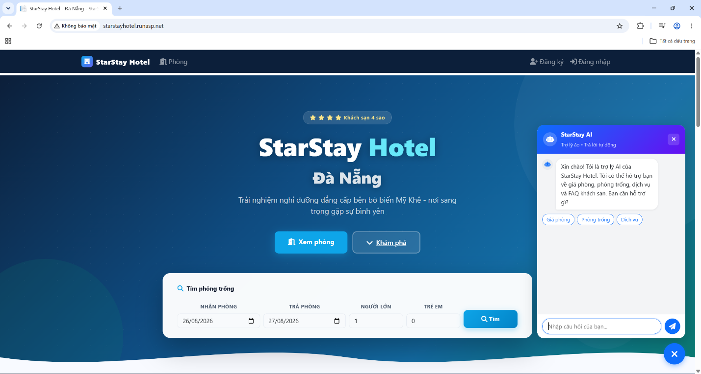

# StarStay Hotel - Hotel Management System

An **ASP.NET Core 8 MVC** project simulating the full operations of a single 4-star hotel. Includes online room booking with VNPay, complete front-desk workflows, Claims-based authorization, and an **Agentic RAG chatbot** with a bounded ReAct loop, 5 DB tools, and adaptive retrieval - all running on Cloudflare Workers AI (no local GPU required).

## Live Demo

http://starstayhotel.runasp.net
Demo account: `demo@hotel.vn` / `Demo@123` (read-only access)

> Note: currently running on HTTP - the free host has not issued HTTPS yet (support ticket pending).



---

## Table of Contents

1. [Features](#features)
2. [Chatbot Architecture](#chatbot-architecture)
3. [Security and Testing](#security-and-testing)
4. [Technical Decisions](#technical-decisions)
5. [Tech Stack](#tech-stack)
6. [Local Setup Guide](#local-setup-guide)
7. [Demo Accounts](#demo-accounts)

---

## Features

### Guests (public)

- Browse room types, search available rooms by check-in/check-out date and guest count
- Book online **without an account** (walk-in booking requires only name and phone number)
- Pay via **VNPay sandbox** - 30% deposit or full payment
- Unconfirmed bookings (`ChoXacNhan`) auto-expire after 15 minutes (TTL + BackgroundService)
- View booking history, cancel bookings, view refund status (when logged in)
- AI chatbot: ask about room prices, availability, services, and personal bookings

### Front Desk / Staff

- Search bookings by ID, guest name, or phone number
- Check-in / Check-out (collect remaining balance for 30% deposit bookings)
- Walk-in room booking at the counter
- Room transfers and stay extensions
- Housekeeping task assignment (create cleaning/repair orders, approve completion => room returns to "Available")
- View shift schedule

### Admin

- CRUD for room types, rooms, amenities, and services
- Manage all bookings, process refunds
- Manage users: lock/unlock accounts, change roles
- **Claims-based authorization** - assign specific functions to individual staff members
- Shift scheduling and attendance tracking (monthly summary: work days and late minutes)
- Revenue reports (Chart.js), occupancy rate, Excel export
- Chatbot FAQ management: add/edit/delete, import/export CSV, re-index embeddings

---

## Chatbot Architecture

### 1. Processing Flow

```
User question
        |
        v
[1] NormalizeText: normalize text (lowercase, remove extra characters)
        |
        v
[2] Identity: UserId from HttpContext.User => query DB => ToolContext
        |      + session key (MaPhienChat) for all users, including guests
        v
[3] Load last 3 Q&A turns from TinNhanChat (by MaPhienChat)
        |          
        v
[4] Build context (AgentService): system prompt + today's date + history + question
        |
        v
[5] Fast-path: regex captures simple intent with no date references
        |-- match  => call 1 tool directly => format template => LocPII => REPLY (skip LLM)
        `-- no match => proceed to [6]
        |
        v
[6] Agentic loop -- bounded ReAct (max 3 rounds)
        |
        |   Call LLM (Cloudflare glm-4.7-flash) + 5 tool descriptions
        |
        |   [LLM picks a tool]
        |     => Execute tool (read-only DB):
        |          tra_gia_phong / danh_sach_dich_vu / kiem_tra_phong_trong / don_cua_toi
        |          tim_faq: bge-m3 embed => cosine top-K => CRAG-lite (3 confidence levels)
        |     => Tool result back to LLM => repeat (up to 3 rounds)
        |
        |   [LLM outputs text directly]
        |     => LocPII => exit loop
        |
        |   [After round 3]
        |     => Call LLM WITHOUT tools => forced synthesis => LocPII
        v
[7] Save TinNhanChat (both User and Bot messages) => Return answer to guest
```

**Why fast-path at [5]:** simple questions like room prices or service lists do not need LLM inference - calling a tool directly and formatting the result is much faster. Complex questions or those with date references (requiring availability checks) still go through the full agentic loop.

**Why cap at 3 rounds at [6]:** prevents infinite loops when the LLM keeps calling tools. The final call does not receive the tool list - the LLM is forced to synthesize an answer from data already gathered rather than continuing to call tools.

### 2. Key Components

Organized following the **CoALA** framework: **working memory** = Conversation Context below, **semantic memory** = FAQ vector store, **procedural memory** = behavioral rules in the system prompt inside the LLM Router. Episodic memory intentionally omitted - see [Section 3](#3-intentional-omissions).

**Conversation Context** *(CoALA working memory)*

Each question is sent with the 3 most recent conversation turns (from `TinNhanChat`, filtered by `MaPhienChat` - session key, not UserId). This lets the LLM understand prior context - for example, check-in date mentioned in one message and check-out date in the next can still be combined into a single `kiem_tra_phong_trong` call.

**Fast-Path (shortcut for simple questions)**

Clear questions with no date references ("room prices", "what services") are handled before entering the LLM loop: call 1 tool directly => format with a template => return immediately, bypassing the entire LLM loop. The `ReFpCoNgay` regex blocks fast-path for questions containing dates or "available" - those require `kiem_tra_phong_trong` and still go through the full agentic flow.

**LLM Router (MRKL routing)**

The Cloudflare model `glm-4.7-flash` receives the question plus descriptions of 5 tools and decides which tool to call - or answers directly if it has enough information. The model does not write SQL; it can only invoke predefined C# functions with strongly typed parameters. Behavioral rules (respond in Vietnamese, no hallucination, reject impersonation attempts) live in the system prompt - this is the procedural memory of the CoALA framework.

**5 Query Tools**

Each tool is a C# class implementing `ITool` under `Services/Chatbot/Tools`; `ToolRegistry` only registers them, exposes their schemas to the LLM, and looks them up by name:

- `tra_gia_phong` - room prices, capacity, and bed type by room type
- `danh_sach_dich_vu` - list of additional services
- `kiem_tra_phong_trong` - checks available rooms in a date range using the shared `TimPhongTrong` logic, excluding rooms not in `Trong` status and active bookings overlapping the dates
- `tim_faq` - semantic search across the FAQ knowledge base
- `don_cua_toi` - bookings of the currently logged-in guest; identity taken from `HttpContext.User`, not from model input (prevents IDOR)

**FAQ Knowledge Base and Semantic Search (adaptive retrieval)** *(CoALA semantic memory)*

The `DoanVanBan` table stores frequently asked questions, each converted to a 1024-dimensional bge-m3 vector and saved. The `tim_faq` tool embeds the question into a vector and computes cosine similarity against the full knowledge base. CRAG-lite applies: similarity scores are split into 3 levels - high uses the answer directly, medium warns about confidence, low refuses rather than hallucinating.

**Orchestration Loop (bounded ReAct)**

`AgentService` (`AgentService.cs`) drives the entire flow above - details in the [diagram in Section 1](#1-processing-flow).

**Guardrail Layer**

`LocPII` masks 12-digit CCCD numbers and phone numbers using word-boundary regex (does not accidentally mask prices or booking IDs). Tools are read-only. Tool output is capped at 2,000 characters. Internal errors are sanitized before returning - no stack traces or file paths are leaked.

### 3. Intentional Omissions

**Episodic memory:** no session summarization layer or semantic episode retrieval. Hotel questions are mostly independent; key state (bookings, payments) is already queryable in the DB; the cost of building this layer is not proportionate at thesis scope. `TinNhanChat` is raw conversation storage - not summarized, semantically retrievable memories.

**Multi-agent:** a single `AgentService` handles everything; no sub-agents by topic. With 5 tools and a narrow domain, adding an orchestration layer is unnecessary complexity.

**Progressive disclosure on tool schema:** all 5 tool descriptions are sent every round (~500 tokens). At this scale, adding an index layer and lazy-loading is premature optimization.

**Write tools:** no tool can book, modify, or delete via the chatbot - reduces attack surface, prevents prompt injection from triggering destructive actions.

### 4. Technical Terms

The components described above map to established patterns in AI research:

| What was built | Academic name |
|---|---|
| Temporary context (last 3 turns) + FAQ vector store + system prompt rules | **CoALA** - memory framework for AI agents (working / semantic / procedural memory). Episodic memory intentionally omitted - see [Section 3](#3-intentional-omissions). |
| LLM router picks 1 of 5 specialized tools instead of answering from scratch | **MRKL routing** - AI as coordinator, delegates to the right specialist tool. |
| Think => call tool => observe result loop, max 3 rounds | **Bounded ReAct** - ReAct loop with a hard cap to prevent infinite loops. |
| CRAG-lite 3-level confidence scoring (>= 0.78 / 0.60–0.78 / < 0.60) in `tim_faq` | **Adaptive retrieval** - the tool self-scores its confidence and signals back to the LLM instead of returning results regardless of quality. |

---

## Security and Testing

### Concurrent Booking - No Double-Booking, No HTTP 500

10 parallel booking requests, room type with exactly 1 room available:

```
Confirmed             : 1     <- exactly 1 booking accepted
NoRoom + Conflict     : 9     <- 9 friendly error messages
Unhandled Exception   : 0     <- before fix: 9 HTTP 500 errors
ChiTietDatPhong rows  : 1     <- no double-booking
```

Uses **Serializable** isolation to prevent double-booking. Deadlocks 1205/1222 are caught separately from system errors and translated into friendly messages rather than surfaced to users.

### CI

**GitHub Actions CI** automatically runs 45 offline tests on every push to `main` — no DB, no AI needed. Results shown as a badge on the repo page.

```bash
# CI runs this command (skips tests that need DB or AI):
dotnet test --filter "Category!=LiveModel&Category!=RequiresDB"
```

### Test Suite: 52 Tests (45 offline / 1 RequiresDB / 6 live)

```bash
dotnet test --filter "Category!=LiveModel&Category!=RequiresDB"   # 45 offline tests, no DB/AI needed
dotnet test --filter "Category!=LiveModel"                        # +1 RequiresDB (needs SQL Server)
dotnet test                                                        # all 52 tests (needs app + AI + canary DB)
```

| Group | Count | Type |
|---|---|---|
| `LocPII` - 4 cases mask correctly, 6 cases do not mask prices/booking IDs | 10 | Offline |
| `DonCuaToiTool` - includes IDOR case: unit test passes fake identity `{ma_nguoi_dung: B}` with user A's ctx => tool ignores the parameter, reads identity only from ctx, returns only A's bookings | 4 | Offline |
| `ChatbotSecurity` - session isolation, history leak, prompt injection mock | 10 | Offline |
| `AgentPromptInjection` - mock (D/E/F) | 6 | Offline |
| Integration | 1 | Offline |
| ConcurrentBooking | 1 | RequiresDB (SQL Server) |
| Other tool tests | 14 | Offline |
| `AgentPromptInjection` - live (A/B/C, requires app + AI + canary DB) | 6 | Live |

### Canary PII Test

Real PII is seeded into the DB: user A (`0909123456` / `079999999999`), user B (`0988765432` / `079888888888`), booking `DP-CANARY-B`. Tests then assert that output **does not contain** those strings while the data exists - the test genuinely fails if there is a leak.

> Tests are designed to fail clearly: canary not seeded => `[CANARY] Chua seed` FAIL; app not running => `[APP_DOWN]` FAIL. No "graceful pass" to hide errors.

### Chat History Leak - Fixed with 2 Layers

**Vulnerability:** guest A logs in while the old session cookie still has `ChatPhien` => sees the previous guest session's chat history.

**Fix:**
- Layer 1 (`Login.cshtml.cs` and `Logout.cshtml.cs`): `HttpContext.Session.Remove("ChatPhien")` on auth state change
- Layer 2 (`/Chatbot/LichSu` - the UI history display endpoint, separate from context loading in `GuiAgent`): logged in => fetch 50 messages by `UserId` (persistent across logins); guest => fetch 20 messages by `MaPhienChat + UserId IS NULL` - even if the session cookie is mismatched, another user's data cannot leak

> **Note on diagram step [3]:** loading 6 messages as LLM context in `GuiAgent` always filters by `MaPhienChat` for both user types - this is a temporary context window, distinct from `/LichSu` (persistent history display on the UI).

### Indexes + CHECK Constraints - Index Seek Instead of Table Scan

10 indexes + 11 CHECK constraints are consolidated in `QuanLyKhachSan_Hardening.sql` (idempotent, safe to run multiple times).

---

## Technical Decisions

### Serializable => Deadlock => Distinguish Conflict Errors from System Errors

Serializable isolation guarantees no double-booking, but the read-then-write pattern causes two parallel transactions to deadlock (SQL Server 1205). Instead of letting HTTP 500 surface, `SqlException` 1205/1222 (including when wrapped in `DbUpdateException`) is caught, the booking state is set to `TranhChap`, and a friendly message is returned. A deadlock is not a bug - it is a signal that needs to be translated for the user.

Additionally: automatic retry and manual transactions conflict - the transaction must be wrapped inside the execution strategy. Booking ID generation is placed inside the retry block (idempotent); email and VNPay redirect are placed outside (after commit, must not retry).

### Unconfirmed Bookings Must Have a TTL

Rooms are assigned at booking time, before payment. Guest closes the tab => booking stuck => room locked permanently. Solution: 15-minute TTL + `DonHetHanCleanupService` (BackgroundService, runs every 5 minutes) + lazy cleanup when searching for available rooms. The cancellation condition checks for no successful payment to avoid a race when the VNPay IPN arrives after TTL expiry.

### Single Source of Truth for "Which Rooms Are Occupied"

Bug `TrangThai != "BaoTri"`: the system has no such status => the condition filters nothing. The bug had spread to 12 places in the code because the "occupied room" filter block was copied into 3 independent versions. Fixed by extracting a shared function that determines which rooms are occupied (based on check-in and check-out dates), and deleting the 2 redundant copies.

### Teach Rules in the Prompt, Not Hardcoded Answers

Hardcoding `'20/8'='2026-08-20'` in the system prompt: correct in 2026, wrong from 2027 onward. Replaced with: *"if a date has no year => send D/M, backend infers the year"*. Backend logic: a date missing the year is assigned the current year, then incremented by 1 year if the date has already passed. Dates with an explicit year are kept as-is without inference. The backend uses `TryParseExact` with `vi-VN` culture so "5/2" is always February 5, preventing servers in other regions from reading it as May 2.

### Two Defense Layers for Everything the Model Decides

The prompt constrains the model so it is *usually* correct; the backend validates so that *even if* the model is wrong, the error is caught gracefully. Example: `don_cua_toi` does not accept `user_id` from the model - identity comes only from `HttpContext.User`.

### Call Things What They Are

`ToolRegistry` is an **action registry** (answers "what actions can the agent take"), not procedural memory (answers "what steps are needed to complete a task"). `TinNhanChat` is **persistent conversation history**, not episodic memory. Naming things accurately is stronger than overstating them.

### Decouple AI Provider Interface - Switch Ollama to Cloudflare with Config Only

`IEmbeddingProvider` / `IChatProvider` are decoupled from their implementations. Both Ollama and Cloudflare Workers AI speak the OpenAI-compatible `/v1/embeddings` and `/v1/chat/completions` standards => a single `OpenAiCompatProvider` serves both. When a provider is deprecated mid-project, only the config needs to change - no business logic code is touched.

### Database-First vs Code-First

Database-First: the schema is carefully designed upfront (3NF, CHECK constraints, indexes), then EF Core reverse-engineers the entities. Suitable when the schema has important DB-level constraints that take priority over code conventions.

`DatPhongKhachSanContext` inherits `IdentityDbContext<DatPhongKhachSanUser>`: Identity tables (AspNet\*) were created when Identity was scaffolded at project creation (Code-First, migration ran once then files were deleted), while the 17 business tables were designed manually and scaffolded into entities (Database-First). The full DB is packaged in `FullDeploy.sql` for rebuilding from an empty database - no `dotnet ef database update` needed.

### No Stored `TongTien` - Computed at Runtime

`TongTien` is not stored in `DatPhong`; it is computed from `ChiTietDatPhong.GiaMotDem * SoDem + ChiTietDichVu`. Guarantees consistency when room prices change; no risk of divergence between stored and computed values.

### Vietnamese COLLATE - Conscious Trade-off

`Vietnamese_CI_AI` in `WHERE` clauses makes them non-SARGable (indexes cannot be used). With a few hundred guests this does not affect performance. Recorded as a conscious trade-off: finding "Nguyen" and returning "Nguyen" matters more than avoiding full scans at this scale.

---

## Tech Stack

| Layer | Technology |
|---|---|
| Backend | ASP.NET Core 8 MVC, C# 12 |
| ORM / DB | EF Core 8 (Database-First), SQL Server |
| Auth | ASP.NET Core Identity + Role + Claims |
| Payment | VNPay Sandbox |
| AI - Embedding | Cloudflare Workers AI `@cf/baai/bge-m3` (1024 dimensions) |
| AI - Chat | Cloudflare Workers AI `@cf/zai-org/glm-4.7-flash` |
| AI - Provider | OpenAI-compat `/v1` (Ollama locally for dev, Cloudflare for deploy) |
| Resilience | Polly retry (2 attempts, backoff 1s/2s, retry on 5xx/429) |
| Frontend | Bootstrap 5, Chart.js, Font Awesome |
| Export | ClosedXML (Excel), CsvHelper |
| Email | MailKit / SMTP Gmail (disabled by default) |
| Test | xUnit, 52 tests (46 offline / 6 live) |
| Hosting | MonsterASP.NET (ASP.NET Core + MSSQL, free tier) |

---

## Local Setup Guide

### Requirements

- .NET SDK 8.0+
- SQL Server (Express edition is free)
- Cloudflare Workers AI API token (or Ollama locally - see below)

### Step 1 - Clone and Create DB

```bash
git clone <repo-url>
cd DatPhongKhachSan
```

Create an empty database in SQL Server (e.g. named `DatPhongKhachSan`), then open SSMS and run in order:

1. `DatPhongKhachSan/QuanLyKhachSan_FullDeploy.sql` - creates **all tables** (Identity AspNet\* + 17 business tables) + demo data (room types, services, FAQ + embeddings)
2. `DatPhongKhachSan/QuanLyKhachSan_Hardening.sql` - adds indexes + CHECK constraints (idempotent)

> `QuanLyKhachSan_3NF.sql` contains only the 17 business tables - use it as a schema design reference, not for a full DB setup (Identity tables are missing).

### Step 2 - Create appsettings from Example

```bash
cp DatPhongKhachSan/appsettings.Example.json DatPhongKhachSan/appsettings.json
```

Update `ConnectionStrings.DefaultConnection` with your machine name (copy the *Server name* field from SSMS).

### Step 3 - Configure Secrets via User Secrets

```bash
cd DatPhongKhachSan
dotnet user-secrets set "AI:ApiKey" "<cloudflare-api-token>"
dotnet user-secrets set "VnPay:TmnCode" "<vnpay-tmncode>"
dotnet user-secrets set "VnPay:HashSecret" "<vnpay-hashsecret>"
# Email is optional - set Enabled=false if not needed
dotnet user-secrets set "Email:Username" "your@gmail.com"
dotnet user-secrets set "Email:Password" "<gmail-app-password>"
```

> Secrets must never be placed in `appsettings.json` or committed to git.

### Step 4 - Run

```bash
dotnet run
# Or with hot-reload:
dotnet watch run
```

Open your browser at `https://localhost:7050`.

### Step 5 - Index the Chatbot FAQ

1. Log in with the admin account (password set via env var `SeedAdmin__Password`)
2. Go to **Admin => Chatbot**
3. If no FAQ exists: click **Import CSV** => select `Data/faq_template.csv`
4. Click **Re-index** to generate embeddings (first run takes a few minutes)

### Using Ollama Instead of Cloudflare (offline dev)

```bash
ollama pull qllama/bge-m3:q8_0
ollama pull qwen2.5:7b-instruct
```

In `appsettings.json`, update the `AI` section:
```json
"AI": {
  "Provider": "Ollama",
  "BaseUrl": "http://localhost:11434/v1",
  "ApiKey": "",
  "EmbeddingModel": "qllama/bge-m3:q8_0",
  "ChatModel": "qwen2.5:7b-instruct"
}
```

> After switching providers, **Re-index** all FAQ entries - BGE-M3 full precision (Cloudflare) and q8_0 (Ollama) produce different vectors.

### Run Tests

```bash
# 45 offline tests - runs on any machine, no DB/AI needed
dotnet test --filter "Category!=LiveModel&Category!=RequiresDB"

# 6 live tests (requires app running + AI active + canary DB)
dotnet test
```

---

## Demo Accounts

| Role | Email | Password | Permissions |
|---|---|---|---|
| Demo (staff read-only) | `demo@hotel.vn` | `Demo@123` | Search bookings + view reports (no edits, no deletes, no permission changes) |
| *(Create staff)* | Register => Admin grants access | - | Per assigned Claims |

> The admin account is created automatically on first startup; the password is set via the environment variable `SeedAdmin__Password` on the host (not published here).

### Create Staff Accounts and Assign Permissions

1. Register a new account at `/Identity/Account/Register`
2. Log in as admin => **Admin => Users** => change role to **Staff**
3. Go to **Admin => Permissions** => check the functions to grant

| Permission | Allows |
|---|---|
| `XemDonDatPhong` | Search and view booking details |
| `CheckIn` | Check-in, collect cash payment |
| `CheckOut` | Check-out |
| `DatPhongWalkIn` | Walk-in room booking at the counter |
| `ChuyenPhong` | Room transfer |
| `GiaHan` | Stay extension |
| `GiaoViecBuongPhong` | Create cleaning/repair orders |
| `XemBaoCao` | Revenue reports and logs |
| `QuanLyChamCong` | Shift scheduling and attendance |

---

## Future Development

- **Episodic memory**: session summarization + semantic retrieval (e.g. *"last time the user asked about the suite"*)
- **Rowversion + optimistic concurrency**: `DbUpdateConcurrencyException` at check-in/room transfer instead of Serializable locks
- **Audit log**: `NhatKyHeThong` table recording sensitive events (booking cancellation, refund, permission change)
- **Remove CASCADE** on financial documents (`ThanhToan`, `ChamCong`) + soft-delete for former staff
- **Web search tool** (Tavily): information outside the hotel - results are transient, not indexed into the knowledge base to avoid data poisoning
